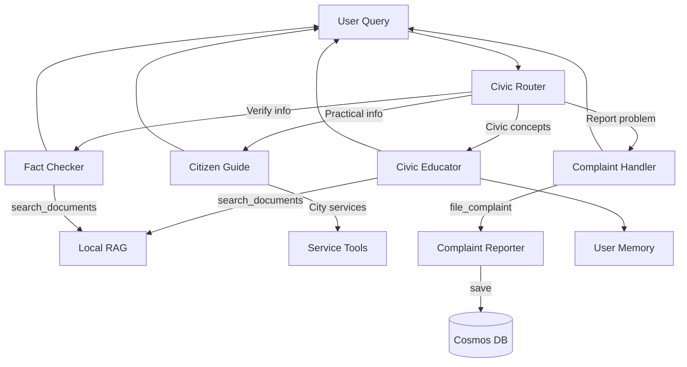

# 🌱 Minka Link

<div align="center">

**Sembrando participación, cosechando comunidad.**

_A free, multilingual, and absolutely neutral civic companion that empowers every citizen with accessible democratic knowledge._

[](https://www.python.org/downloads/)
[](https://learn.microsoft.com/en-us/agent-framework/)
[](https://azure.microsoft.com/en-us/products/ai-services/openai-service)
[](LICENSE)

[Features](#-features) • [Quick Start](#-quick-start) • [Architecture](#-architecture) • [Documentation](#-documentation) • [Contributing](#-contributing)

</div>

---

## � What iis Minka Link?

**Minka Link** is an intelligent multi-agent system that makes civic education as easy as talking to your phone in your native language. Built with Microsoft Agent Framework and Azure AI, it provides neutral, accurate, and accessible civic information for any city or country.

### 🌱 The Minka Philosophy

**Minka** is an ancestral Andean concept representing **collaborative community work** and **reciprocity**. Just as traditional minka builds bridges and roads for the community, Minka Link builds bridges of civic knowledge between citizens and their democracy.

**Core Principles:**

-   🤝 **Ayni (Reciprocity)**: Civic knowledge is a common good
-   � **\*Ayllu (Community)**: Every citizen belongs to the democratic community
-   💪 **Mink'a (Collective Work)**: Technology and agents work together
-   ⚖️ **Yanantin (Complementarity)**: Diversity strengthens the system

📖 [Read more about Minka Philosophy](docs/FILOSOFIA_MINKA.md)

---

## ✨ Features

### 🤖 Intelligent Multi-Agent System

-   **5 specialized agents** working collaboratively using Handoff Pattern
-   **Civic Router**: Intelligently routes queries to the right specialist
-   **Civic Educator**: Explains government concepts and democracy
-   **Citizen Guide**: Provides practical info about procedures and services
-   **Complaint Handler**: Guides users to report problems
-   **Fact Checker**: Verifies information with official sources

### 🌍 Global & Multilingual

-   ✅ **Automatic language detection** - responds in user's language
-   ✅ **Location-aware** - adapts to any city or country
-   ✅ **Supports Spanish, English, and more**

### � Neutral & Trustworthy

-   ✅ **Absolute neutrality** - no political bias or recommendations
-   ✅ **Official sources only** - .gov/.gob sites
-   ✅ **Fact-based responses** - verifiable information

### 🛠️ Advanced Capabilities

-   ✅ **Document search** - RAG with indexed PDFs
-   ✅ **Web search** - Bing Search for real-time information
-   ✅ **User memory** - Persistent profiles with AI extraction
-   ✅ **Complaint reporting** - Conversational collection with Cosmos DB
-   ✅ **Web interface** - User-friendly frontend
-   ✅ **CLI interface** - Command-line interaction

---

## 🚀 Quick Start

### Prerequisites

-   Python 3.12 or higher
-   Azure OpenAI access
-   Azure CLI installed and authenticated

### Installation

```bash
# Clone the repository
git clone https://github.com/your-org/minka-link.git
cd minka-link

# Install uv (fast Python package manager)
curl -LsSf https://astral.sh/uv/install.sh | sh

# Install dependencies
uv sync

# Configure environment variables
cp .env.example .env
# Edit .env with your Azure credentials

# Authenticate with Azure CLI
az login
```

### Usage

```bash
# Single query
python main.py "Where can I vote in NYC?"

# Interactive mode
python main.py

# Help
python main.py --help
```

### Example Queries

```bash
# Civic education (any language)
python main.py "¿Qué es un concejal?"
python main.py "What is a city council member?"

# Practical guidance
python main.py "Where can I vote in Buenos Aires?"
python main.py "Requisitos para votar en México"

# Complaint reporting
python main.py "I want to report a pothole in Madrid"
python main.py "Quiero reportar basura en mi calle"

# Fact checking
python main.py "Is voting mandatory in Argentina?"
```

💡 **Tip**: Always mention your city or country for specific, accurate responses.

---

## 🏗️ Architecture

### Multi-Agent Orchestration (Handoff Pattern)



### Technology Stack

| Layer               | Technology                | Status |
| ------------------- | ------------------------- | ------ |
| **Agent Framework** | Microsoft Agent Framework | ✅     |
| **LLM**             | Azure OpenAI GPT-4o       | ✅     |
| **Database**        | Azure Cosmos DB           | ✅     |
| **Document Search** | Local RAG (pypdf)         | ✅     |
| **Web Search**      | Bing Search API           | ✅     |
| **Frontend**        | Web Interface             | ✅     |
| **CLI**             | Python asyncio            | ✅     |
| **Auth**            | Azure CLI Credential      | ✅     |

---

## 📖 Documentation

### Core Documentation

-   📘 [MVP Status & Architecture](docs/mvp.md) - Current implementation and roadmap
-   🌱 [Minka Philosophy](docs/FILOSOFIA_MINKA.md) - Andean principles in civic tech
-   🦸 [Tools & Superpowers](docs/TOOLS_SUPERPODERES.md) - Agent capabilities guide
-   🔧 [Complaint System](docs/COMPLAINT_REPORTER_SETUP.md) - Complaint reporting setup

### Technical Guides

-   🤖 [Agent Framework Guide](agents/README.md) - Agent implementation details
-   🔍 [RAG Setup](agents/tools/FOUNDRY_RAG_SETUP.md) - Document search configuration
-   ⚙️ [Configuration](config/settings.py) - Centralized settings

### Use Cases

-   📋 [Use Cases](docs/casos-de-uso.md) - Real-world scenarios

---

## 🎯 Current Capabilities

### ✅ What Works Now

1. **Multi-agent orchestration** - Intelligent routing to specialized agents
2. **Multilingual support** - Automatic language detection and response
3. **Civic education** - Neutral explanations of government concepts
4. **Practical guidance** - Actionable information about procedures
5. **Complaint reporting** - Conversational collection with Cosmos DB storage
6. **Fact checking** - Verification with official sources
7. **User memory** - Persistent profiles with AI extraction
8. **Document search** - Local RAG with PDF indexing
9. **Web search** - Bing Search for real-time information
10. **Location awareness** - Adapts to user's city/country
11. **Absolute neutrality** - No political bias or recommendations
12. **Web interface** - User-friendly frontend application

---

## 🤝 Contributing

We welcome contributions! Here's how you can help:

### Development Setup

```bash
# Fork and clone the repository
git clone https://github.com/luiscm17/minka-link.git
cd minka-link

# Install dependencies
uv sync

# Configure environment
cp .env.example .env
# Edit .env with your credentials

# Run locally
python main.py
```

### Code Standards

-   ✅ All prompts and comments in English
-   ✅ Agents respond in user's language
-   ✅ Follow Microsoft Agent Framework patterns
-   ✅ Maintain absolute neutrality in all responses
-   ✅ Document all configuration options
-   ✅ Write tests for new features

### How to Contribute

1. Fork the project
2. Create your feature branch (`git checkout -b feature/AmazingFeature`)
3. Commit your changes (`git commit -m 'Add some AmazingFeature'`)
4. Push to the branch (`git push origin feature/AmazingFeature`)
5. Open a Pull Request

---

## 📊 Project Structure

```yml
minka-link/
├── agents/                         # Agent implementations
│   ├── civic_orchestration.py     # Main orchestrator (5 agents)
│   ├── complaint_reporter_agent.py # Complaint collection
│   ├── local_rag_agent.py         # PDF document search
│   ├── user_memory.py             # User profile management
│   └── tools/                     # Agent tools
│       ├── nyc_services.py        # NYC-specific services
│       ├── bing_search_tools.py   # Web search integration
│       └── azure_foundry_rag.py   # Azure AI Search RAG
├── config/
│   └── settings.py                # Centralized configuration
├── data-resource/                 # PDF documents for RAG
├── data_user/                     # User profiles (local fallback)
├── docs/                          # Documentation
├── frontend/                      # Web interface
├── main.py                        # CLI entry point
├── pyproject.toml                 # Dependencies
└── .env                           # Configuration (not in repo)
```

---

## 🔒 Ethical Guardrails

Minka Link is built with unbreakable ethical principles:

| Rule                                | Implementation                               |
| ----------------------------------- | -------------------------------------------- |
| **NEVER recommend vote**            | Explicit instruction in all agent prompts    |
| **NEVER express political opinion** | "Absolute neutrality" principle              |
| **ONLY official sources**           | Tools configured for .gov/.gob sites only    |
| **Respond in user's language**      | Automatic language detection                 |
| **No political bias**               | No party, candidate, or ideology favoritism  |
| **Fact-based only**                 | Verifiable information from official sources |

---

## 📚 Resources

-   [Microsoft Agent Framework](https://learn.microsoft.com/en-us/agent-framework/)
-   [Handoff Pattern Guide](https://learn.microsoft.com/en-us/agent-framework/user-guide/workflows/orchestrations/handoff)
-   [Azure OpenAI Service](https://azure.microsoft.com/en-us/products/ai-services/openai-service)
-   [Azure Cosmos DB](https://azure.microsoft.com/en-us/products/cosmos-db)

---

## 📝 License

Copyright (c) Microsoft. All rights reserved.

Licensed under the MIT License. See [LICENSE](LICENSE) for more information.

---

## 🌟 Acknowledgments

Developed with ❤️ to empower citizens with accessible civic information, honoring the Andean traditions of collaborative community work.

**Special thanks to:**

-   The Andean communities for inspiring the Minka philosophy
-   Microsoft Agent Framework team for the powerful orchestration tools
-   Azure AI team for the cognitive services
-   All contributors and supporters of civic technology

---

<div align="center">

**Minka Link** - Building bridges of civic knowledge, together.

_"Just as traditional minka builds bridges and roads for the community, Minka Link builds bridges of knowledge between citizens and their democracy."_

🌱 **Sembrando participación, cosechando comunidad.** 🌱

[⬆ Back to top](#-minka-link)

</div>
