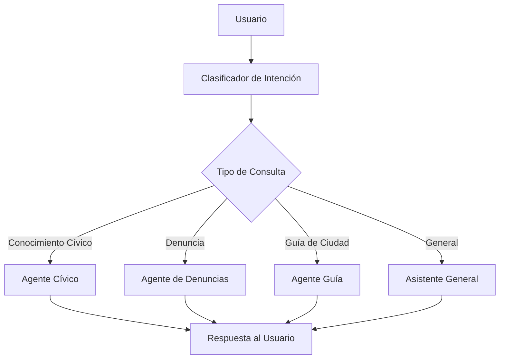

# Civic Chat - Asistente Cívico Multi-Agente

## Descripción

Civic Chat es un asistente cívico inteligente construido con Microsoft Agent Framework y Azure OpenAI. Utiliza múltiples agentes especializados para ayudar a ciudadanos con información cívica, presentación de denuncias, y adaptación a la ciudad.

### Características Principales

- 🤖 **Arquitectura Multi-Agente**: Sistema de agentes especializados con orquestación inteligente
  - **Clasificador de Intención**: Determina automáticamente qué agente debe responder
  - **Agente de Conocimiento Cívico**: Información sobre votación, elecciones y gobierno
  - **Agente de Denuncias**: Ayuda a registrar quejas y reportes ciudadanos
  - **Agente Guía de Ciudad**: Información práctica para adaptarse a la ciudad
- 🧠 **Memoria Persistente**: Recuerda el contexto del usuario entre sesiones
- 🌍 **Soporte Multilingüe**: Responde en español e inglés
- 💬 **Interfaz de Chat**: Interacción natural por línea de comandos

## Arquitectura

El sistema usa un patrón **SwitchCase** donde un clasificador determina la intención del usuario y enruta al agente apropiado:



## Instalación

### Requisitos Previos

- **Python 3.12+**
- **[uv](https://docs.astral.sh/uv/)** - Gestor de paquetes Python
- **Azure CLI** - Para autenticación (`az login`)
- **Cuenta de Azure** con:
  - Azure OpenAI Service (deployment de GPT-4o-mini)

### Pasos de Instalación

1. **Clonar el repositorio**:

```bash
git clone <repository-url>
cd chatbot-civic
```

2. **Instalar dependencias**:

```bash
uv sync
```

3. **Configurar variables de entorno**:

```bash
# Copiar archivo de ejemplo
cp src/civic_chat/.env.example src/civic_chat/.env

# Editar .env con tus credenciales de Azure
# Requerido:
#   AZURE_OPENAI_ENDPOINT=https://your-resource.openai.azure.com/
#   AZURE_OPENAI_API_VERSION=2024-10-21
```

4. **Autenticarse con Azure CLI**:

```bash
az login
az account set --subscription "your-subscription-id"
```

## Uso

### Ejecutar la Aplicación

```bash
uv run python src/civic_chat/main.py
```

### Ejemplos de Uso

**Consultas de Conocimiento Cívico:**

```
👤 You: ¿Cómo me registro para votar?
🤖 Assistant: Para registrarte para votar en los Estados Unidos...

👤 You: What does Congress do?
🤖 Assistant: The U.S. Congress is the legislative branch...
```

**Presentar una Denuncia:**

```
👤 You: Quiero reportar un bache peligroso
🤖 Assistant: Estoy aquí para ayudarte a registrar tu denuncia...
```

**Guía de Ciudad:**

```
👤 You: ¿Cómo funciona el metro?
🤖 Assistant: El sistema de metro funciona de la siguiente manera...
```

**Salir de la aplicación:**

```
👤 You: exit
```

## Estructura del Proyecto

```
chatbot-civic/
├── src/civic_chat/              # Código fuente principal
│   ├── agents/                  # Implementaciones de agentes
│   │   ├── civic_knowledge_agent.py
│   │   ├── complaint_agent.py
│   │   ├── city_guide_agent.py
│   │   ├── memory/             # Gestión de memoria
│   │   └── complaint/          # Sistema de denuncias
│   ├── workflows/               # Orquestación de agentes
│   │   └── agents_orchestration.py
│   ├── config/                  # Configuración
│   └── main.py                  # Punto de entrada
├── tests/                       # Tests
├── user_data/                   # Datos de usuario persistentes
├── complaints_data/             # Denuncias registradas
└── README.md                    # Este archivo
```

## Tecnologías

- **Microsoft Agent Framework**: Orquestación multi-agente
- **Azure OpenAI**: GPT-4o-mini para capacidades LLM
- **Python 3.12**: Lenguaje de programación
- **uv**: Gestor de paquetes Python
- **pytest**: Framework de testing

## Solución de Problemas

### Errores Comunes

**1. Error de Autenticación de Azure**

```bash
# Asegúrate de estar autenticado con Azure CLI
az login
az account set --subscription "your-subscription-id"
```

**2. Errores de Importación de Módulos**

```bash
# Sincronizar dependencias
uv sync
```

**3. Límites de Rate de Azure OpenAI**

El sistema reintenta automáticamente con backoff exponencial. Si persiste, verifica tu cuota de Azure OpenAI.

## Licencia

[Especificar licencia]

## Contacto

[Información de contacto]
