# 🌱 The Minka Philosophy in Minka Link

## What is Minka?

**Minka** (also written as "mink'a") is an ancestral concept from Andean cultures (Aymara and Quechua) that represents **collaborative community work** based on reciprocity and solidarity.

### Origin and Meaning

In traditional Andean communities, minka is a practice where community members voluntarily unite to work on projects that benefit everyone:

- 🏘️ Construction of houses, bridges, and roads
- 🌾 Agricultural work on communal lands
- 💧 Irrigation systems
- 🏛️ Public buildings and community spaces

The essence of minka is not just physical work, but the values it represents:

## The Four Pillars of Minka

### 1. **Ayni** (Reciprocity)

> "Today for you, tomorrow for me"

The principle that what you give to the community returns to you. In Minka Link:

- Civic knowledge is a common good
- Information flows freely among all
- Each query helps improve the system for everyone

### 2. **Ayllu** (Community)

> "We are all part of the whole"

The recognition that we all belong to a larger community. In Minka Link:

- Every citizen, regardless of origin, language, or education, is part of the democratic community
- Diversity strengthens the system
- No one is excluded from civic knowledge

### 3. **Mink'a** (Collective Work)

> "Together we are stronger"

Collaborative work where each contributes according to their capacity. In Minka Link:

- Multiple specialized agents work together
- Each agent has unique expertise
- Collaboration produces better results than individual work

### 4. **Yanantin** (Complementarity)

> "Opposites complement each other"

The Andean principle that differences complement to create balance. In Minka Link:

- Different perspectives enrich responses
- Technology and humanity complement each other
- Diversity of needs creates a more robust system

## Minka Link: Applying Andean Philosophy to Civic Technology

### Why "Minka" for a Civic Chatbot?

The connection is deep and meaningful:

#### 1. **Community Building**

Just as traditional minka builds physical infrastructure (bridges, roads, houses), **Minka Link builds knowledge infrastructure** - bridges between citizens and their democracy.

#### 2. **Collaborative Agent Work**

Minka Link's specialized agents work as a community:

Each contributes their specialty, just like in traditional minka where each person contributes their unique skills.

#### 3. **Digital Reciprocity**

- Each answered question improves the system
- Shared knowledge benefits the entire community
- Each user's participation strengthens democracy

#### 4. **Inclusion and Accessibility**

Like minka that includes all community members:

- **Multilingual**: Speaks the user's language
- **Free**: No economic barriers
- **Neutral**: No political bias
- **Accessible**: Designed for all education levels

## The Meaning of "Link"

**Link** (connection) complements **Minka** representing:

### Connections We Build

```mermaid
mindmap
  root((Minka Link<br/>Connections))
    Citizens ↔ Government
      Services
      Processes
      Information
    Questions ↔ Answers
      Verified knowledge
      Accessible info
      Real-time data
    Communities ↔ Resources
      Equitable access
      Shared knowledge
      Collective benefit
    Tradition ↔ Technology
      Ancestral values
      Modern tools
      Cultural respect
```

### Digital Bridges

Just as physical bridges built in traditional minkas connect communities separated by rivers or mountains, Minka Link builds digital bridges that connect:

- Citizens with civic information
- Different languages and cultures
- Complex knowledge with simple understanding
- Government with the governed

## Design Principles Inspired by Minka

### 1. **Neutrality as Balance (Yanantin)**

- No political bias
- Present all sides fairly
- Balance between different perspectives

### 2. **Accessibility as Inclusion (Ayllu)**

- Simple language for all
- Multiple languages
- No entry barriers

### 3. **Collaboration as Strength (Mink'a)**

- Agents working together
- Each with their specialty
- The whole is greater than the sum of parts

### 4. **Reciprocity as Sustainability (Ayni)**

- Knowledge shared freely
- Continuous system improvement
- Mutual benefit for all

## Minka in Action: Examples

### Example 1: Voting Query

**Minka in action**: Specialized collaborative work for the common good.

### Example 2: Information Verification

**Minka in action**: Community protection through verified knowledge.

### Example 3: Problem Report

**Minka in action**: Collective maintenance of the common good.

## Future Vision: Expanding the Digital Minka

### Phase 1: NYC (Current)

- Establish the digital minka model
- Validate the effectiveness of agent collaboration
- Build trust in the community

### Phase 2: Regional Expansion

- Bring minka to more cities
- Adapt to local contexts
- Maintain fundamental principles

### Phase 3: Global Minka

- Network of connected digital minkas
- Share knowledge between communities
- Strengthen democracies globally

## Honoring the Roots

Minka Link honors Andean traditions by:

1. **Recognizing the Origin**: Openly explaining where the concept comes from
2. **Applying the Principles**: Not just using the name, but living the values
3. **Sharing Knowledge**: Educating about minka philosophy
4. **Building Community**: Creating spaces for genuine collaboration

## Conclusion: Building Bridges Together

> *"Just as traditional minka builds bridges and roads for the community, Minka Link builds bridges of knowledge between citizens and their democracy."*

Minka teaches us that:

- **Together we are stronger** than apart
- **The common good** is everyone's responsibility
- **Reciprocity** creates sustainable communities
- **Collaboration** produces better results

Minka Link is not just a chatbot - it's a **digital minka**, a space where technology, knowledge, and community unite to build something that benefits everyone: a more accessible, informed, and participatory democracy.

---

## References and Further Reading

### About Traditional Minka

- Andean concept of community work
- Practices in Quechua and Aymara communities
- Philosophy of reciprocity and ayni

### Modern Applications

- Cooperatives and community organizations
- Sustainable development projects
- Technology for the common good

### Academic Resources

- **"The Andean World"** - Indigenous perspectives on community work
- **"Reciprocity and Redistribution in Andean Civilizations"** - Economic anthropology
- **"Technology and Social Justice"** - Modern applications of traditional values

---

*Developed with respect and admiration for the Andean traditions that teach us the power of community collaboration.*

🌱 **Minka Link** - Building bridges of civic knowledge, together.

**Sembrando participación, cosechando comunidad.**  
*Sowing participation, harvesting community.*
