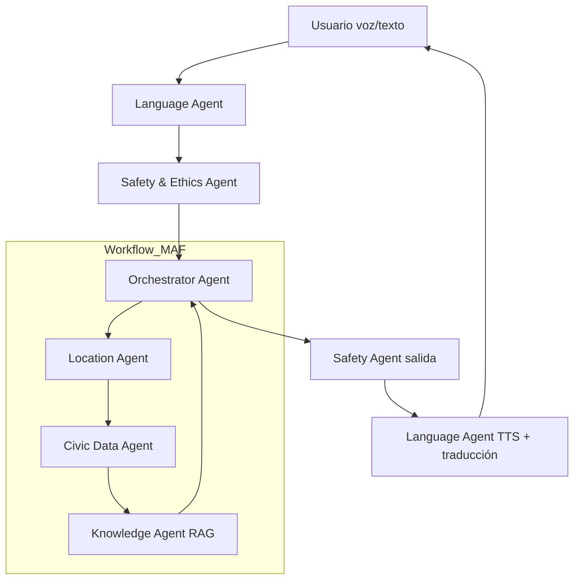

# Documento Oficial de Arquitectura y Desarrollo del MVP  

**Civic Chat – Versión MAF (Microsoft Agent Framework) + Azure**
**Estado:** Aprobado para desarrollo inmediato  
**Tecnología principal:** Microsoft Agent Framework (Python) + Azure AI Foundry  

## 1. Visión del Producto (según Ken Granderson y documentos originales)

> “Un compañero cívico siempre gratuito, activado por voz, multilingüe y absolutamente neutral que coloca el poder explicativo completo de la democracia en el bolsillo de cada ciudadano — sin compromisos, sin sesgos y sin guardianes.”

**Objetivo del MVP:**  
Validar en la ciudad y estado de Nueva York que la educación cívica es tan fácil como hablar con tu teléfono en tu idioma nativo → la gente la usará.

## 2. Alcance del MVP (Fase 1 – Core)

| En alcance (MVP listo en ≤ 6 semanas) | Fuera de alcance (post-MVP) |
|----------------------------------------|-----------------------------|
| Localización por dirección o GPS → representantes actuales (todos los niveles) | Elecciones próximas y propuestas de boleta |
| Explicación neutral de roles y responsabilidades de cargos | Comparación de candidatos |
| Interacción 100 % por voz o texto | Análisis histórico de votaciones |
| 5 idiomas completos (inglés, español, árabe, bengalí, criollo haitiano) | Registro de votantes |
| Neutralidad absoluta (0 recomendaciones de voto) | Gamificación / AR |
| Caché inteligente de audio para contenido estático | Notificaciones proactivas |

## 3. Arquitectura Multi-Agente con Microsoft Agent Framework (Python)



### Lista definitiva de agentes (MAF Python)

| Agente | Tipo MAF | Responsabilidad principal | Azure Service |
|--------|----------|----------------------------|---------------|
| Orchestrator Agent | GraphWorkflow + Magentic | Dirige todo el flujo, decide rutas, mantiene estado | Azure Container Apps |
| Safety & Ethics Agent (entrada/salida) | ReviewerAgent | Bloquea cualquier recomendación, sesgo o fuente no oficial | Azure Content Safety + custom guardrails |
| Language Agent | WorkerAgent + Tools | STT → detección idioma → traducción → TTS | Azure Speech Services + Translator |
| Location Agent | WorkerAgent | Normaliza dirección → distritos electorales | Azure Maps + PostGIS (PostgreSQL) |
| Civic Data Agent | WorkerAgent | Recupera representantes actuales por distrito | Azure Cosmos DB + NYC Open Data APIs |
| Knowledge Agent | RAG Agent | Explicaciones neutrales de cargos + citas oficiales | Azure AI Search (índice vectorial + lexical) |
| Cache Agent (opcional) | WorkerAgent | Genera y sirve audio pre-renderizado | Azure Blob Storage + CDN |

## 4. Stack Tecnológico 100 % Azure + MAF (Python)

| Capa | Tecnología elegida | Justificación |
|------|---------------------|---------------|
| Orquestación de agentes | Microsoft Agent Framework (Python) | Soporta grafos, magentic, hand-off, stateful |
| LLM principal | Azure OpenAI GPT-4o (2025-11) | Mejor latencia y costo que GPT-4o-mini para razonamiento ético |
| Voz y traducción | Azure Speech Services (neural voices) + Translator | 150+ idiomas, voces naturales, streaming |
| Búsqueda RAG | Azure AI Search (vector + hybrid) | Índice curado de descripciones oficiales de cargos |
| Base de datos estructurada | Azure Cosmos DB (Core SQL API) + PostgreSQL + PostGIS | Datos de representantes + distritos |
| Geolocalización | Azure Maps | Normalización de direcciones y reverse geocoding |
| Moderación y guardrails | Azure Content Safety + custom prompts | Bloqueo automático de recomendaciones |
| Caché de audio estático | Azure Blob Storage + Azure CDN | Reducción >80 % costo TTS |
| Frontend (PWA instalable) | React + Vite + Tailwind + Web Speech API (fallback) | Instalación en 1 tap, funciona offline |
| Backend / Agentes | Azure Container Apps (Python 3.12) | Autoscaling, zero-ops, secrets con Key Vault |
| Observabilidad | Azure Application Insights + Log Analytics | Métricas de neutralidad, latencia, violaciones |
| CI/CD | GitHub Actions → Azure DevOps | Tests automáticos de neutralidad por agente |

## 5. Contratos entre Agentes (estándar MAF)

```python
from pydantic import BaseModel
from typing import Dict, Any, Optional

class CivicChatRequest(BaseModel):
    user_input: str                    # texto o audio base64
    input_mode: str = "text"           # "text" | "voice"
    user_language: Optional[str] = None
    location: Optional[str] = None     # dirección o coordenadas
    session_id: str                    # para estado multi-turn

class CivicChatResponse(BaseModel):
    response_text: str
    response_audio_url: Optional[str] = None
    sources: list[Dict[str, str]]      # URLs oficiales
    language_used: str
    confidence: float
```

Todos los agentes implementan la interfaz MAF `Agent.execute(request: CivicChatRequest) → CivicChatResponse`

## 6. Guardrails Éticos Inquebrantables (implementados en Safety Agent)

| Regla | Implementación técnica |
|------|-------------------------|
| NUNCA recomendar voto | Content Safety + regex + LLM guardrail |
| NUNCA expresar opinión política | Prompt system + ReviewerAgent |
| SOLO fuentes oficiales | Azure AI Search solo indexa .gov / sitios oficiales |
| Neutralidad 100 % | Tests automáticos diarios (500 prompts de provocación) |

## 7. Roadmap de Desarrollo (6 semanas)

| Semana | Hito | Entregable |
|-------|------|------------|
| 1 | Setup Azure + MAF skeleton | Repo + CI/CD + 3 agentes básicos |
| 2 | Language Agent completo (5 idiomas) + Speech | Voz → voz funcionando en español/árabe |
| 3 | Location + Civic Data + RAG | Consulta “¿Quién me representa en Brooklyn?” |
| 4 | Safety Agent + guardrails automáticos | 0 violaciones en test de provocación |
| 5 | Orchestrator con GraphWorkflow + caché audio | MVP completo + PWA |
| 6 | Beta cerrada (100 usuarios reales NYC) | Métricas + ajustes finales |

## 8. Métricas de Éxito del MVP

| Métrica | Objetivo |
|--------|----------|
| Usuarios activos (30 días) | ≥ 5.000 (meta realista para beta NYC) |
| Latencia voz → voz | ≤ 2.8 segundos |
| Precisión STT/TTS (5 idiomas) | ≥ 92 % |
| Violaciones éticas detectadas | 0 |
| Tasa de completación de conversación | ≥ 80 % |
| Costo promedio por consulta | ≤ $0.008 |
