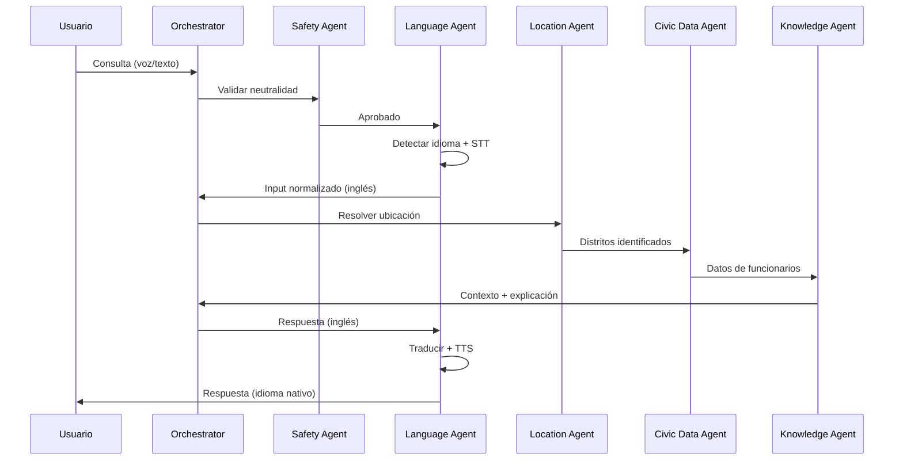

# Civic Chat - Documento MVP Consolidado

**Understanding Democracy Made Easier, With the Power of AI**  

---

## Resumen Ejecutivo

Civic Chat es una plataforma de participación cívica impulsada por Inteligencia Artificial generativa que democratiza el acceso a información gubernamental mediante un asistente conversacional multilingüe, neutral y accesible por voz.

### Tesis Central

Una mayor comprensión del funcionamiento del gobierno, facilitada por la accesibilidad multilingüe y la información objetiva, conduce a una participación ciudadana más alineada con sus intereses.

### Objetivo del MVP

Validar que si la educación cívica es tan fácil como hablar con tu teléfono en tu propio idioma, las personas la usarán. El MVP se enfoca en Nueva York (NYC y Estado) como piloto inicial, con arquitectura diseñada para expansión global.

---

## I. Alcance del MVP

### En Alcance (MVP)

| Funcionalidad | Descripción |
|---------------|-------------|
| **Funcionarios Actuales** | Información de representantes electos (local → federal) |
| **Roles y Responsabilidades** | Explicaciones claras de qué hace cada cargo |
| **Interacción por Voz** | Speech-to-Text + Text-to-Speech completo |
| **Multilingüe** | 15+ idiomas con traducción en tiempo real |
| **Localización** | Dirección o geolocalización → resolución de distritos |
| **Neutralidad Estricta** | Guardrails éticos que prohíben recomendaciones |

### Fuera de Alcance (Post-MVP)

- Elecciones próximas y propuestas de boleta
- Comparación de candidatos y plataformas
- Registro de votantes o ubicación de centros de votación
- Análisis histórico de votaciones
- Gamificación o experiencias AR

---

## II. Casos de Uso Principales

### Módulo A: Acceso Fundamental y Localización

| ID | Caso de Uso | Descripción |
|----|-------------|-------------|
| **CU-A1** | Localización de Representantes | Usuario proporciona dirección/ubicación → sistema identifica funcionarios electos en todos los niveles |
| **CU-A2** | Definición de Roles | Usuario consulta función de un cargo → sistema explica rol, alcance y responsabilidades |
| **CU-A3** | Interacción Universal | Usuario interactúa por voz o texto en su idioma nativo (15+ idiomas soportados) |

### Módulo B: Educación Electoral Neutral (Fase 2)

| ID | Caso de Uso | Descripción |
|----|-------------|-------------|
| **CU-B1** | Clarificación de Propuestas | Usuario pregunta sobre propuesta electoral → sistema desglosa en términos simples |
| **CU-B2** | Consulta Factual de Candidatos | Usuario pregunta sobre postura de candidato → sistema presenta declaraciones de fuentes oficiales |
| **CU-B3** | Comparación Objetiva | Usuario solicita comparación entre candidatos → sistema presenta posiciones sin juicios de valor |

### Módulo C: Diálogo Cívico Avanzado (Fase 3)

| ID | Caso de Uso | Descripción |
|----|-------------|-------------|
| **CU-C1** | Análisis Multi-Demográfico | Usuario solicita análisis de política → sistema presenta impacto en diversos grupos socioeconómicos |
| **CU-C2** | Adaptación de Nivel | Sistema adapta complejidad según conocimiento político del usuario |

---

## III. Arquitectura Multi-Agente

### Principios de Diseño

1. **Generación Aumentada por Recuperación (RAG)**: Respuestas fundamentadas en datos cívicos precisos y actuales
2. **Estrategia de Lenguaje Base Único**: Indexación y razonamiento en inglés, traducción solo en entrada/salida
3. **Gobernanza Ética Integrada**: Guardrails en cada capa de la arquitectura
4. **Modularidad**: Componentes desacoplados para escalabilidad y contribución open-source

### Agentes del Sistema

| Agente | Responsabilidad | Servicios Azure |
|--------|-----------------|-----------------|
| **Orchestrator Agent** | Control de flujo conversacional, enrutamiento de agentes, ensamblaje de respuesta final | Azure AI Foundry + Semantic Kernel |
| **Safety & Ethics Agent** | Verificación de neutralidad, bloqueo de recomendaciones partidistas, aplicación de guardrails | Azure Content Safety + prompts system |
| **Language Agent** | Reconocimiento de voz, detección de idioma, traducción, síntesis de voz | Azure Speech Service (150+ idiomas) |
| **Location Agent** | Normalización de dirección → distritos electorales | Azure Maps + PostGIS |
| **Civic Data Agent** | Recuperación de funcionarios actuales y responsabilidades oficiales | Azure Cosmos DB + APIs cívicas |
| **Knowledge Agent** | Explicaciones RAG de roles gubernamentales | Azure AI Search + base curada |

### Flujo de Interacción



---

## IV. Stack Tecnológico (100% Azure)

| Capa | Tecnología |
|------|------------|
| **Frontend** | React + TypeScript + Vite + Tailwind CSS (PWA) |
| **Voz y Traducción** | Azure Speech Service (STT/TTS/Translation) |
| **Orquestación** | Azure AI Foundry + Microsoft Agent Framework + Semantic Kernel |
| **Backend** | Azure Functions / Azure Container Apps (Python) |
| **LLM Principal** | GPT-4o via Azure OpenAI Service (o Grok-4 como alternativa) |
| **Vector Search** | Azure AI Search (RAG knowledge base) |
| **Datos Estructurados** | Azure Cosmos DB (NoSQL) + PostgreSQL con PostGIS |
| **Hosting** | Azure Static Web Apps (frontend) + Azure Container Apps (agentes) |
| **Monitoreo** | Azure Application Insights + Azure Content Safety |
| **CI/CD** | GitHub Actions → Azure DevOps |

---

## V. Principios de IA Responsable

### Guardrails Éticos Obligatorios

#### ❌ Prohibiciones Absolutas

1. **NO Recomendar Voto**: Nunca indicar por quién votar o qué opción elegir
2. **NO Expresar Opiniones**: Nunca tomar posición política o favorecer ideología
3. **NO Usar Fuentes No Oficiales**: Solo citar sitios oficiales, documentos gubernamentales
4. **NO Crear Callejones Sin Salida**: Nunca limitar exploración del usuario

#### ✅ Obligaciones Absolutas

1. **SÍ Presentar Información Objetiva**: Basada en hechos verificables de fuentes oficiales
2. **SÍ Citar Fuentes**: Transparencia total sobre origen de información
3. **SÍ Mantener Neutralidad**: Igual tratamiento para todos los candidatos/posiciones
4. **SÍ Empoderar al Usuario**: Facilitar decisión informada respetando autonomía

### Implementación de Responsible AI

| Principio | Implementación |
|-----------|----------------|
| **Fairness** | Sin inferencia de datos demográficos; respuestas neutrales para todos |
| **Reliability & Safety** | Safety Agent como gatekeeper; umbral de confianza >0.85 |
| **Privacy & Security** | Datos efímeros; encriptación E2E con Azure Key Vault |
| **Inclusiveness** | 150+ idiomas/dialectos; fallback a texto si voz falla |
| **Transparency** | Metadatos de fuentes en cada respuesta; logs auditables |
| **Accountability** | Logs anonimizados; auditorías automáticas para detectar sesgo |

---

## VI. Estrategia Multilingüe

### Idiomas Soportados (MVP)

Inglés, Español, Ruso, Bengalí, Criollo Haitiano, Coreano, Árabe, Polaco, Urdu, Francés, Yiddish, Griego, Italiano, Tagalo, Punjabi, Vietnamita (16+ idiomas)

### Arquitectura de Traducción

1. **Lenguaje Base**: Inglés para indexación y razonamiento
2. **Traducción Periférica**:
   - **Entrada**: Idioma nativo → Inglés
   - **Salida**: Inglés → Idioma nativo
3. **Optimización de Costos**: Caché de audio MP3 para contenido estático (descripciones de cargos)

### Beneficios

- Evita deriva de traducción (*translation drift*)
- Mantiene precisión factual
- Reduce costos operativos
- Facilita mantenimiento de base de conocimiento

---

## VII. Flujo de Usuario Típico (MVP)

1. Usuario abre civicchat.nyc (PWA - instalable con un tap)
2. Bot: "Hello / Hola / Bonjou / 您好… ¿En qué idioma quieres hablar?"
3. Selección automática o manual de idioma
4. "Comparte tu dirección o permite ubicación" → resolución instantánea de distritos
5. Bot lista representantes actuales con cargo, partido, foto, contacto
6. Usuario pregunta (voz/texto): "¿Qué hace el Public Advocate?"
7. Bot explica en lenguaje claro con fuentes citadas
8. Respuesta disponible como audio con voz neural natural

---

## VIII. Métricas de Éxito (MVP)

| Métrica | Objetivo |
|---------|----------|
| Usuarios activos (30 días) | ≥ 10,000 |
| Tasa de completación de conversación | ≥ 75% |
| Latencia promedio (voz → voz) | ≤ 2.5 segundos |
| Idiomas con ≥90% precisión STT/TTS | 15+ |
| Violaciones de recomendación detectadas | 0 |
| Cumplimiento de neutralidad y citación | 100% |
| Precisión de traducción | > 95% |
| Precisión de transcripción (STT) | > 90% |

---

## IX. Fases de Implementación

### Fase 1: Funcionalidad Core (MVP)

**Prioridad**: Alta  
**Casos de Uso**: CU-A1, CU-A2, CU-A3

- Consulta básica de funcionarios actuales
- Explicación de roles y responsabilidades
- Soporte multilingüe (inglés, español inicialmente)
- Interacción por voz básica
- Localización por dirección

### Fase 2: Educación Electoral

**Prioridad**: Alta  
**Casos de Uso**: CU-B1, CU-B2, CU-B3

- Clarificación de propuestas en boletas
- Consulta factual de candidatos
- Comparación objetiva de posiciones
- Expansión a 16+ idiomas
- Optimización de caché de audio

### Fase 3: Análisis Avanzado

**Prioridad**: Media  
**Casos de Uso**: CU-C1, CU-C2

- Análisis multi-perspectiva de impacto
- Adaptación al nivel de sofisticación política
- Exploración abierta de temas
- Recordatorios y guía de votación

### Fase 4: Expansión y Comunidad

**Prioridad**: Baja

- Portal de contribución comunitaria
- Verificación de sesgo de fuentes (Media Bias Fact Check)
- Expansión geográfica (otros estados/países)
- Notificaciones proactivas
- Automatización de tareas cívicas (runbooks)

---

## X. Requisitos Técnicos Mínimos

### Arquitectura Modular

- Código base modular y bien documentado
- Interfaces claras entre agentes (contratos estrictos)
- Facilita contribución comunitaria global
- Preparado para expansión a otros países

### Pruebas y Calidad

- Pruebas de unidad para cada componente
- Acuerdo claro sobre formatos de entrada/salida
- Validación de neutralidad automatizada
- Monitoreo continuo de sesgo

### Sostenibilidad

- Mecanismos de reducción de costos (caché de TTS)
- Modelo de sostenibilidad basado en colaboraciones cívicas
- Crowdsourcing de datos locales
- Licencia MIT para código (open-source al completar MVP)
- Datasets bajo Creative Commons

---

## XI. Contratos entre Agentes

### Formato Estandarizado

```csharp
public record AgentRequest(
    string UserInput,                        // Entrada normalizada del usuario
    string LanguageCode,                     // ej. "es-ES", "ht-HT"
    Dictionary<string, object> Context       // Metadatos previos (ej. distritos)
);

public record AgentResponse(
    string Content,                          // Resultado principal
    Dictionary<string, object> Metadata,     // Fuentes, confidence score
    bool IsFinal = false,                    // Solo Orchestrator lo marca true
    string NextAgent = null                  // Sugerencia para siguiente agente
);

public interface ICivicAgent
{
    string Name { get; }
    Task<AgentResponse> ExecuteAsync(AgentRequest request, CancellationToken ct);
}
```

### Beneficios

- Inmutabilidad y auditoría
- Interoperabilidad garantizada
- Trazabilidad completa
- Facilita testing y debugging

---

## XII. Visión a Largo Plazo

### Compromiso Open-Source

Al completar validación del MVP:

- Capa de orquestación de agentes: MIT License
- Base de conocimiento y frontend: MIT License
- Pipelines de datos: Creative Commons
- Datasets cívicos curados: Creative Commons
- Modelo de gobernanza con mantenedores comunitarios
- Consejo asesor para expansión global

### Expansión Global

- Arquitectura preparada para 100+ países
- Plataforma de contribución de contenido cívico localizado
- Comunidades internacionales pueden inyectar datos locales
- Aprovecha arquitectura RAG multilingüe existente
- Visión de "pequeña 'd' democracia" global

### Innovaciones Futuras

- Motor de notificaciones proactivas
- Agente de automatización de tareas cívicas
- Simulación de debates equilibrados
- Análisis histórico y contextual de instituciones
- Integración con sistemas de verificación de sesgo

---

## XIII. Contacto y Recursos

**Fundador**: Ken Granderson  
**Email**: <ken@blackfacts.com>  
**Website**: <https://civicchat.nyc>  
**Estado**: Propuesta lista para financiamiento, partnership y ejecución de desarrollo

---

## Conclusión

Civic Chat representa la expresión más pura de una visión democrática: un compañero cívico siempre gratuito, activado por voz, multilingüe, que coloca el poder explicativo completo de la democracia en el bolsillo de cada ciudadano — sin compromisos, sin sesgos y sin guardianes.

El MVP está diseñado para validar esta tesis con un enfoque láser en Nueva York, mientras construye la infraestructura técnica y ética necesaria para una expansión global responsable y sostenible.

**Ready for funding, partnership, and development execution.**
