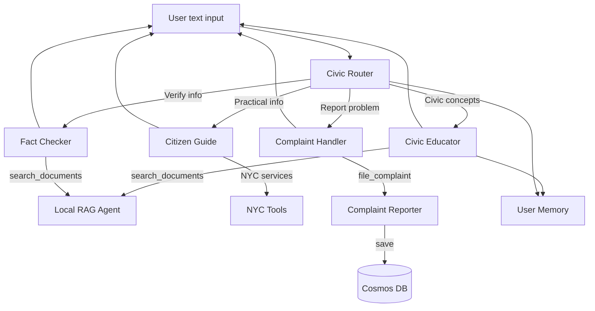

# Minka Link - MVP Status & Architecture

**Minka Link – Microsoft Agent Framework + Azure**  
**Status:** ✅ Core MVP Implemented  
**Technology:** Microsoft Agent Framework (Python) + Azure OpenAI + Cosmos DB  

## 1. Product Vision

> "A free, multilingual, and absolutely neutral civic companion that puts the full explanatory power of democracy in every citizen's pocket — no compromises, no biases, no gatekeepers."

**MVP Goal:**  
Validate that civic education can be as easy as talking to your phone in your native language → people will use it.

**Current Status:** Core multi-agent system operational with specialized agents, user memory, and complaint reporting.

## 2. MVP Scope - What We've Built

### ✅ Implemented Features

| Feature | Status | Implementation |
|---------|--------|----------------|
| **Multi-agent orchestration** | ✅ Complete | Handoff pattern with 5 specialized agents |
| **Multilingual support** | ✅ Complete | Responds in user's language automatically |
| **Civic education** | ✅ Complete | Civic Educator agent with RAG support |
| **Practical guidance** | ✅ Complete | Citizen Guide with NYC services tools |
| **Complaint reporting** | ✅ Complete | Conversational agent + Cosmos DB storage |
| **Fact checking** | ✅ Complete | Fact Checker with official sources |
| **User memory** | ✅ Complete | Persistent profiles with AI extraction |
| **Document search** | ✅ Complete | Local RAG with PDF indexing |
| **Web search** | ✅ Complete | Bing Search for official sources |
| **Absolute neutrality** | ✅ Complete | No political recommendations in prompts |
| **Text interaction** | ✅ Complete | CLI + interactive mode |
| **Web interface** | ✅ Complete | Frontend application deployed |

### 🚧 Planned Features (Post-MVP)

| Feature | Priority | Notes |
|---------|----------|-------|
| Voice interaction (STT/TTS) | High | Azure Speech Services integration |
| PWA capabilities | High | Make web interface installable |
| Azure AI Search RAG | Medium | Alternative to local RAG |
| Election information | Medium | Upcoming elections and ballot proposals |
| Voter registration | Low | Link to official registration portals |
| Audio caching | Low | Pre-rendered responses for common queries |

## 3. Current Multi-Agent Architecture



### Implemented Agents (Microsoft Agent Framework)

| Agent | Type | Responsibility | Tools/Services |
|-------|------|----------------|----------------|
| **Civic Router** | ChatAgent (Coordinator) | Silent router, transfers to correct specialist | Handoff tools |
| **Civic Educator** | ChatAgent | Explains civic concepts, government, democracy | search_documents, web search (optional) |
| **Citizen Guide** | ChatAgent | Practical info about procedures and services | find_polling_location, check_voter_registration, find_government_office, get_document_requirements |
| **Complaint Handler** | ChatAgent | Guides users to report problems | search_311_services, file_complaint |
| **Fact Checker** | ChatAgent | Verifies information with official sources | search_documents, web search (optional) |
| **Complaint Reporter** | ChatAgent (as tool) | Conversational complaint collection | save_complaint (Cosmos DB) |
| **Local RAG Agent** | @ai_function | Searches indexed PDF documents | pypdf + in-memory search |
| **User Memory Provider** | ContextProvider | Persistent user profiles with AI extraction | Cosmos DB (with local fallback) |

## 4. Technology Stack (Current Implementation)

| Layer | Technology | Status | Notes |
|-------|-----------|--------|-------|
| **Agent orchestration** | Microsoft Agent Framework (Python) | ✅ Implemented | Handoff pattern with 5 agents |
| **LLM** | Azure OpenAI GPT-4o | ✅ Implemented | Via Azure CLI credentials |
| **Database** | Azure Cosmos DB (Core SQL API) | ✅ Implemented | Complaints + user memory |
| **Document search** | Local RAG (pypdf + in-memory) | ✅ Implemented | Searches PDFs in data-resource/ |
| **Web search** | Bing Search API | ✅ Implemented | Official sources search (.gov, .gob) |
| **Configuration** | Pydantic Settings + .env | ✅ Implemented | Centralized in config/settings.py |
| **CLI** | Python asyncio | ✅ Implemented | Interactive and single-query modes |
| **Frontend** | Web interface | ✅ Implemented | User-facing web application |
| **Authentication** | Azure CLI Credential | ✅ Implemented | For OpenAI and Cosmos DB |
| **Package management** | uv + pyproject.toml | ✅ Implemented | Fast, modern Python tooling |

### Planned Additions

| Layer | Technology | Priority | Purpose |
|-------|-----------|----------|---------|
| Voice I/O | Azure Speech Services | High | STT + TTS for voice interaction |
| PWA features | Service Workers + Manifest | High | Make web interface installable |
| Advanced RAG | Azure AI Search | Medium | Vector + hybrid search |
| Geolocation | Azure Maps | Medium | Address normalization |
| Observability | Application Insights | Medium | Metrics and monitoring |
| Deployment | Azure Container Apps | Medium | Production hosting |
| CI/CD | GitHub Actions | Low | Automated testing |

## 5. Agent Communication Pattern

### Current Implementation (Handoff Pattern)

```python
# User query flows through the system
query = "Where can I vote in NYC?"

# 1. Civic Router analyzes and transfers
civic_router.handoff_to_citizen_guide(query)

# 2. Citizen Guide processes with tools
citizen_guide.execute(query)
  → find_polling_location(address="NYC")
  → Returns practical information

# 3. Response streams back to user
response = "You can find your polling location at..."
```

### User Memory Integration

```python
# User profile is injected into agent context
[USER PROFILE]:
- Name: Juan
- Location: Buenos Aires
- Profession: engineer

[CONTEXT FROM PREVIOUS CONVERSATIONS]:
- Consulted procedures: voting in New York
- Mentioned documents: ID, passport
- Important dates: March 15
```

### Complaint Reporting Flow

```python
# Conversational complaint collection
user: "I want to report a pothole"
complaint_handler → file_complaint("pothole")
  → complaint_reporter: "What city is the problem in?"
  → user: "Buenos Aires, Av. Corrientes 1234"
  → complaint_reporter: saves to Cosmos DB
  → Returns tracking ID
```

## 6. Ethical Guardrails (Implemented in Agent Instructions)

| Rule | Implementation |
|------|----------------|
| **NEVER recommend vote** | Explicit instruction in all agent prompts |
| **NEVER express political opinion** | "Absolute neutrality" principle in prompts |
| **ONLY official sources** | Tools configured for .gov/.gob sites only |
| **Respond in user's language** | "RESPOND IN USER'S LANGUAGE" in all prompts |
| **No political bias** | "No party, candidate, or ideology bias" instruction |
| **Fact-based only** | "Base responses on verifiable facts" requirement |

### Example Guardrail (from Civic Educator)

```markdown
PRINCIPLES:
- **Absolute neutrality**: No party, candidate, or ideology bias
- **Accessibility**: Simple language, avoid jargon
- **Accuracy**: Base responses on verifiable facts
- **Inclusivity**: Respect all legitimate political perspectives
- **Educational**: Empower with knowledge, not opinions
- **Contextual**: Adapt to user's country/city
```

## 7. Project Structure

```yml
minka-link/
├── agents/
│   ├── civic_orchestration.py      # Main orchestrator with 5 agents
│   ├── complaint_reporter_agent.py # Conversational complaint collection
│   ├── local_rag_agent.py          # PDF document search
│   ├── rag_agent.py                # Azure AI Search (optional)
│   ├── user_memory.py              # Persistent user profiles
│   └── tools/
│       ├── nyc_services.py         # NYC-specific tools
│       ├── bing_search_tools.py    # Bing Search integration ✅
│       └── azure_foundry_rag.py    # Azure AI Foundry RAG
├── config/
│   └── settings.py                 # Centralized configuration
├── data-resource/                  # PDF documents for RAG
├── data_user/                      # Local user profiles (fallback)
├── docs/                           # Documentation
├── frontend/                       # Web interface ✅
│   └── ...                         # Frontend application files
├── main.py                         # CLI entry point
├── pyproject.toml                  # Dependencies
└── .env                            # Configuration (not in repo)
```

## 8. How to Run

### Prerequisites

```bash
# Install uv (Python package manager)
curl -LsSf https://astral.sh/uv/install.sh | sh

# Install dependencies
uv sync

# Configure Azure credentials
az login

# Set environment variables
cp .env.example .env
# Edit .env with your Azure OpenAI endpoint and deployment
```

### Run Backend (CLI)

```bash
# Interactive mode
python main.py

# Single query
python main.py "Where can I vote in NYC?"
```

### Run Frontend

```bash
# Navigate to frontend directory (if separate)
cd frontend

# Install dependencies and run
npm install
npm run dev

# Or follow frontend-specific instructions
```

### Example Queries

```bash
# Civic education (any language)
python main.py "¿Qué es un concejal?"
python main.py "What is a city council member?"

# Practical guidance
python main.py "Where can I vote in Buenos Aires?"

# Complaint reporting
python main.py "I want to report a pothole in Madrid"

# Fact checking
python main.py "Is it true that voting is mandatory in Argentina?"
```

## 9. Current Capabilities

### ✅ What Works Now

1. **Multi-agent orchestration**: Router intelligently transfers queries to specialized agents
2. **Multilingual**: Automatically responds in user's language (Spanish, English, etc.)
3. **Civic education**: Explains government concepts with neutral, accessible language
4. **Practical guidance**: Provides actionable information about procedures and services
5. **Complaint reporting**: Conversational collection and storage in Cosmos DB
6. **Fact checking**: Verifies information with official sources
7. **User memory**: Remembers user profile and context across sessions
8. **Document search**: Searches indexed PDFs for official information
9. **Web search**: Bing Search integration for real-time official sources
10. **Location awareness**: Adapts responses to user's city/country
11. **Absolute neutrality**: No political recommendations or bias
12. **Web interface**: User-friendly frontend application

### 🎯 Success Metrics (When Deployed)

| Metric | Target | Current Status |
|--------|--------|----------------|
| Agent response accuracy | ≥ 90% | ✅ Implemented with specialized agents |
| Neutrality violations | 0 | ✅ Guardrails in all prompts |
| Language support | 5+ languages | ✅ Automatic language detection |
| Query completion rate | ≥ 80% | 🚧 Needs production testing |
| Average cost per query | ≤ $0.01 | 🚧 Needs production measurement |

## 10. Future Improvements

### High Priority (Next 4-8 weeks)

1. **Voice Interface**
   - Azure Speech Services integration (STT + TTS)
   - Streaming audio for low latency
   - Support for 5+ languages with neural voices
   - Target: ≤ 2.8 seconds voice-to-voice latency

2. **PWA Capabilities**
   - Make web interface installable on mobile
   - Service Workers for offline support
   - Web Speech API integration
   - Push notifications for civic updates

3. **Production Deployment**
   - Azure Container Apps hosting
   - Application Insights monitoring
   - Auto-scaling configuration
   - CI/CD pipeline with GitHub Actions

### Medium Priority

5. **Advanced RAG with Azure AI Search**
   - Vector + hybrid search
   - Larger document corpus
   - Better relevance ranking
   - Semantic search capabilities

6. **Enhanced Location Services**
   - Azure Maps integration
   - Address normalization
   - District/precinct lookup
   - GPS coordinate support

7. **Election Information**
   - Upcoming elections calendar
   - Ballot proposals and measures
   - Polling location finder
   - Early voting information

8. **Audio Caching**
   - Pre-render common responses
   - Azure Blob Storage + CDN
   - Reduce TTS costs by >80%
   - Faster response times

### Low Priority

9. **Voter Registration Assistance**
   - Link to official registration portals
   - Eligibility checking
   - Deadline reminders
   - Document requirements

10. **Multi-City Expansion**
    - Expand beyond NYC
    - Buenos Aires, Madrid, Mexico City
    - Localized service tools
    - Regional civic data

11. **Advanced Analytics**
    - User engagement metrics
    - Query pattern analysis
    - Neutrality monitoring
    - Cost optimization insights

12. **Accessibility Features**
    - Screen reader optimization
    - High contrast mode
    - Keyboard navigation
    - Simplified language mode

### Research & Exploration

13. **Proactive Notifications**
    - Election reminders
    - Registration deadlines
    - Local civic events
    - Requires user opt-in

14. **Gamification**
    - Civic knowledge quizzes
    - Achievement badges
    - Learning progress tracking
    - Community leaderboards

15. **AR/VR Integration**
    - Virtual government building tours
    - Interactive civic education
    - Immersive voting simulations
    - Requires significant R&D

## 11. Technical Debt & Known Issues

### Current Limitations

1. **No conversation history**: Each query is independent (UserMemoryProvider maintains profile only)
2. **Local RAG only**: Simple keyword search, not semantic
3. **No voice interface**: Text-only interaction (web and CLI)
4. **Not installable**: Web interface not yet PWA
5. **Limited testing**: No automated test suite yet
6. **No production deployment**: Runs locally only
7. **Manual configuration**: Requires Azure CLI login and .env setup

### Planned Fixes

- Implement conversation history with AgentThread pattern
- Add comprehensive test suite (unit + integration)
- Create deployment scripts for Azure Container Apps
- Add health checks and monitoring
- Implement rate limiting and error handling
- Add logging and observability

## 12. Contributing

### Development Setup

```bash
# Clone repository
git clone https://github.com/your-org/minka-link.git
cd minka-link

# Install dependencies
uv sync

# Configure environment
cp .env.example .env
# Edit .env with your credentials

# Run tests (when implemented)
pytest

# Run locally
python main.py
```

---

**Minka Link** - Building bridges of civic knowledge, together.  
*Inspired by the Andean tradition of collaborative community work.*
